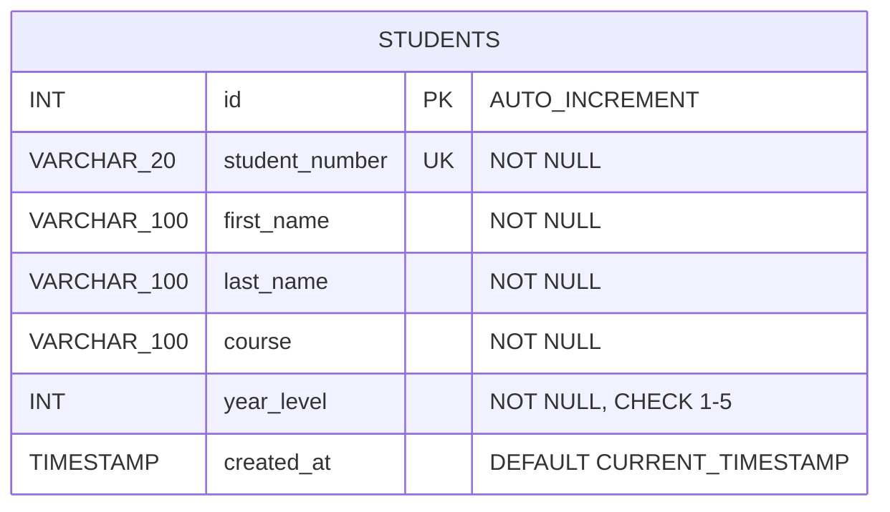

# ER Diagram & API Documentation
## Student Record Management System — IT323 Midterm PIT

---

## ER Diagram (Crow's Foot Notation — Mermaid)



> **Single-entity model.** The system operates on one canonical `students` table. No foreign key relationships exist at this stage. Future expansions (courses master table, enrollment records, user accounts) would introduce additional entities and relationships.

---

## ER Diagram (Text-Based Table View)

```
┌────────────────────────────────────────────────────┐
│                      STUDENTS                      │
├─────────────────┬──────────────┬───────────────────┤
│ Column          │ Type         │ Constraints        │
├─────────────────┼──────────────┼───────────────────┤
│ id (PK)         │ INT          │ AUTO_INCREMENT, NN │
│ student_number  │ VARCHAR(20)  │ UNIQUE, NOT NULL   │
│ first_name      │ VARCHAR(100) │ NOT NULL           │
│ last_name       │ VARCHAR(100) │ NOT NULL           │
│ course          │ VARCHAR(100) │ NOT NULL           │
│ year_level      │ INT          │ NOT NULL (1–5)     │
│ created_at      │ TIMESTAMP    │ DEFAULT NOW()      │
└─────────────────┴──────────────┴───────────────────┘
```

**Entity:** `students`
**Primary Key:** `id` (surrogate, auto-incremented)
**Natural Key:** `student_number` (unique, business identifier)
**Relationships:** Single-entity model (no foreign keys at this stage)

---

## API Documentation

**Base URL:** `http://localhost:3000/api/students`
**Content-Type:** `application/json`

---

### 1. GET /api/students

| Property | Value |
|---|---|
| **Method** | GET |
| **Endpoint** | `/api/students` |
| **Description** | Retrieve all students, ordered by `last_name ASC` |
| **Request Body** | None |

**Sample Response (200 OK):**
```json
{
  "success": true,
  "data": [
    {
      "id": 7,
      "student_number": "2023300007",
      "first_name": "Elena",
      "last_name": "Aquino",
      "course": "BSBA",
      "year_level": 1,
      "created_at": "2025-01-15T08:30:00.000Z"
    },
    {
      "id": 5,
      "student_number": "2023300005",
      "first_name": "Luz",
      "last_name": "Bautista",
      "course": "BSN",
      "year_level": 2,
      "created_at": "2025-01-15T08:30:04.000Z"
    }
  ]
}
```

**Status Codes:**

| Code | Meaning |
|---|---|
| 200 | Success |
| 500 | Database / server error |

---

### 2. GET /api/students/:id

| Property | Value |
|---|---|
| **Method** | GET |
| **Endpoint** | `/api/students/:id` |
| **Description** | Retrieve a single student by primary key |
| **URL Param** | `id` – integer |
| **Request Body** | None |

**Sample Response (200 OK):**
```json
{
  "success": true,
  "data": {
    "id": 1,
    "student_number": "2023300001",
    "first_name": "Maria",
    "last_name": "Santos",
    "course": "BSIT",
    "year_level": 2,
    "created_at": "2025-01-15T08:30:00.000Z"
  }
}
```

**Status Codes:**

| Code | Meaning |
|---|---|
| 200 | Student found |
| 404 | Student not found |
| 500 | Server error |

---

### 3. POST /api/students

| Property | Value |
|---|---|
| **Method** | POST |
| **Endpoint** | `/api/students` |
| **Description** | Register a new student |
| **Request Body** | JSON (see below) |

**Request Body:**
```json
{
  "student_number": "2023300011",
  "first_name": "Andrea",
  "last_name": "Flores",
  "course": "BSIT",
  "year_level": 1
}
```

**Sample Response (201 Created):**
```json
{
  "success": true,
  "message": "Student created successfully.",
  "data": {
    "id": 11,
    "student_number": "2023300011",
    "first_name": "Andrea",
    "last_name": "Flores",
    "course": "BSIT",
    "year_level": 1,
    "created_at": "2025-06-01T10:00:00.000Z"
  }
}
```

**Status Codes:**

| Code | Meaning |
|---|---|
| 201 | Student created |
| 400 | Validation error / duplicate student number |
| 500 | Server error |

---

### 4. PUT /api/students/:id

| Property | Value |
|---|---|
| **Method** | PUT |
| **Endpoint** | `/api/students/:id` |
| **Description** | Update an existing student record |
| **URL Param** | `id` – integer |
| **Request Body** | JSON (all fields required) |

**Request Body:**
```json
{
  "student_number": "2023300001",
  "first_name": "Maria",
  "last_name": "Santos",
  "course": "BSCS",
  "year_level": 3
}
```

**Sample Response (200 OK):**
```json
{
  "success": true,
  "message": "Student updated successfully.",
  "data": {
    "id": 1,
    "student_number": "2023300001",
    "first_name": "Maria",
    "last_name": "Santos",
    "course": "BSCS",
    "year_level": 3,
    "created_at": "2025-01-15T08:30:00.000Z"
  }
}
```

**Status Codes:**

| Code | Meaning |
|---|---|
| 200 | Student updated |
| 400 | Validation error / duplicate student number |
| 404 | Student not found |
| 500 | Server error |

---

### 5. DELETE /api/students/:id

| Property | Value |
|---|---|
| **Method** | DELETE |
| **Endpoint** | `/api/students/:id` |
| **Description** | Permanently delete a student record |
| **URL Param** | `id` – integer |
| **Request Body** | None |

**Sample Response (200 OK):**
```json
{
  "success": true,
  "message": "Student deleted successfully."
}
```

**Status Codes:**

| Code | Meaning |
|---|---|
| 200 | Student deleted |
| 404 | Student not found |
| 500 | Server error |

---

### 6. GET /api/students/search/:keyword

| Property | Value |
|---|---|
| **Method** | GET |
| **Endpoint** | `/api/students/search/:keyword` |
| **Description** | Search students using `LIKE '%keyword%'` on `first_name`, `last_name`, `student_number`, and `course`; results ordered `last_name ASC` |
| **URL Param** | `keyword` – string |
| **Request Body** | None |

**Example:** `GET /api/students/search/santos`

**Sample Response (200 OK):**
```json
{
  "success": true,
  "data": [
    {
      "id": 1,
      "student_number": "2023300001",
      "first_name": "Maria",
      "last_name": "Santos",
      "course": "BSIT",
      "year_level": 2,
      "created_at": "2025-01-15T08:30:00.000Z"
    }
  ]
}
```

**Status Codes:**

| Code | Meaning |
|---|---|
| 200 | Results returned (may be empty array) |
| 500 | Server error |
